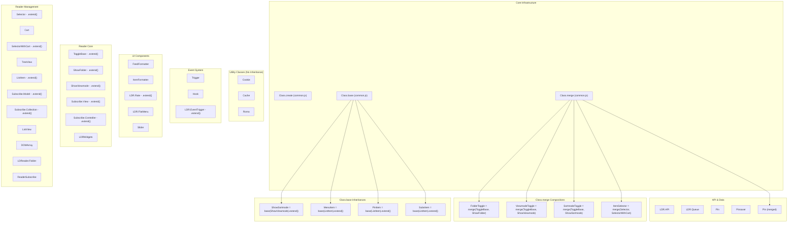

# Dependency Map - Prototype.js Removal Project

## Class System Overview

### Class.create Usage (35 instances in 17 files)



### Complexity Classification

#### Simple (No inheritance, no merge) - 18 classes
| Class | File | Methods |
|-------|------|---------|
| Cookie | `lib/utils/common.js` | 3 |
| Cache | `lib/utils/common.js` | ~3 |
| Roma | `lib/utils/roma.js` | ~5 |
| Trigger | `lib/events/event_dispatcher.js` | 8 |
| Hook | `lib/reader/event_hook.js` | ~3 |
| LDR.API | `lib/api.js` | ~5 |
| LDR.Queue | `lib/models/queue.js` | ~4 |
| Pin | `lib/models/pin.js` | ~5 |
| Pinsaver | `lib/models/pin.js` | ~3 |
| FeedFormatter | `lib/ui/feed.js` | ~5 |
| ItemFormatter | `lib/ui/item.js` | ~5 |
| LDR.FlatMenu | `lib/ui/flat_menu.js` | ~5 |
| Slider | `lib/ui/flat_menu.js` | ~3 |
| LDRWidgets | `lib/reader/main.js` | ~5 |
| Cart | `lib/reader/manage.js` | ~3 |
| TreeView | `lib/reader/folder.js` | ~5 |
| ListView | `lib/reader/addon.js` | ~5 |
| DOMArray | `lib/reader/addon.js` | ~3 |

#### Medium (.extend() pattern) - 11 classes
| Class | File | Extends From |
|-------|------|-------------|
| LDR.Rate | `lib/ui/rate.js` | Class.create().extend() |
| LDR.EventTrigger | `lib/reader/event_hook.js` | Class.create().extend() |
| ToggleBase | `lib/reader/main.js` | Class.create().extend() |
| ShowFolder | `lib/reader/main.js` | Class.create().extend() |
| ShowViewmode | `lib/reader/main.js` | Class.create().extend() |
| Subscribe.View | `lib/reader/main.js` | Class.create().extend() |
| Subscribe.Controller | `lib/reader/main.js` | Class.create().extend() |
| Selector | `lib/reader/manage.js` | Class.create().extend() |
| SelectorWithCart | `lib/reader/manage.js` | Class.create().extend() |
| ListItem | `lib/reader/folder.js` | Class.create().extend() |
| Subscribe.Model | `lib/reader/subscriber.js` | Class.create().extend() |
| Subscribe.Collection | `lib/reader/subscriber.js` | Class.create().extend() |
| LDReader.Folder | `lib/subscribe/subscribe.js` | Class.create() |
| ReaderSubscribe | `lib/subscribe/subscribe.js` | Class.create() |

#### Complex (Class.merge / Class.base) - 9 compositions
| Result Class | Pattern | Sources |
|-------------|---------|---------|
| FolderToggle | `Class.merge()` | ToggleBase + ShowFolder |
| ViewmodeToggle | `Class.merge()` | ToggleBase + ShowViewmode |
| SortmodeToggle | `Class.merge()` | ToggleBase + ShowSortmode |
| ItemSelector | `Class.merge()` | Selector + SelectorWithCart |
| Pin (merged) | `Class.merge()` | Pin + Pinsaver |
| ShowSortmode | `Class.base().extend()` | ShowViewmode (base) |
| MenuItem | `Class.base().extend()` | ListItem (base) |
| PinItem | `Class.base().extend()` | ListItem (base) |
| SubsItem | `Class.base().extend()` | ListItem (base) |

## Prototype Extension Methods Usage

### Array Extensions (defined in `proto.js` and `common.js`)

| Method | Usage Count | Replacement |
|--------|------------|-------------|
| `.forEach()` | 70+ | Native (ES5+) - remove polyfill only |
| `.map()` | 29+ | Native (ES5+) - remove polyfill only |
| `.filter()` | 30+ | Native (ES5+) - remove polyfill only |
| `.invoke(method)` | 10+ | `.map(item => item[method]())` |
| `.pluck(key)` | 12+ | `.map(item => item[key])` |
| `.sort_by(fn)` | 4 | `.sort((a,b) => fn(a) - fn(b))` |
| `.partition(fn)` | 2 | Custom utility |
| `.reject(fn)` | 2+ | `.filter(item => !fn(item))` |
| `.first()` | 2 | `array[0]` or `array.at(0)` |
| `.last()` | 2 | `array.at(-1)` |
| `.compact()` | 1 | `.filter(Boolean)` |
| `.flatten()` | 3 | `.flat()` |
| `.uniq()` | 1 | `[...new Set(array)]` |
| `.filter_by(key, val)` | 2 | `.filter(item => item[key] === val)` |
| `.indexOfA(fn)` | 2 | `.findIndex(fn)` |
| `.toDF()` | 4+ | Custom utility (data formatting) |
| `.mode()` | 1 | Custom utility |

### String Extensions (defined in `proto.js`)

| Method | Usage Count | Replacement |
|--------|------------|-------------|
| `.fill(params)` | 25+ | Template literal or custom `Util.template()` |
| `.escapeHTML()` | 10+ | Custom utility or DOM text node |
| `.unescapeHTML()` | 10+ | Custom utility or DOM innerHTML |
| `.strip()` | 1 | `.trim()` |
| `.startWith(str)` | 1+ | `.startsWith(str)` |
| `.aroundTag(tag)` | 3 | Template literal |
| `.strip_tags()` | 1 | Custom utility |

### Function Extensions (defined in `proto.js` and `common.js`)

| Method | Usage Count | Replacement |
|--------|------------|-------------|
| `.bind()` / `.bindThis()` | 15+ | Native `.bind()` |
| `.curry(args)` | 6+ | Arrow function + `.bind()` |
| `.later(ms)` | 12+ | `setTimeout(() => fn(), ms)` |
| `.forEachArgs()` | 4 | Custom utility |
| `.invert()` | 1+ | `(...args) => !fn(...args)` |

### Number Extensions (defined in `proto.js`)

| Method | Usage Count | Replacement |
|--------|------------|-------------|
| `.zerofill(n)` | 6+ | `.toString().padStart(n, '0')` |
| `.toHex()` | 0 (unused) | Delete |
| `.between(a, b)` | 0 (unused) | Delete |

## DOM/Event Helper Usage

### DOM Helpers

| Function | Usage Count | Replacement |
|----------|------------|-------------|
| `_$(id)` | 80+ | `document.getElementById(id)` |
| `$N(tag, attrs, children)` | 3 | `document.createElement()` + attributes |
| `addClass(el, cls)` | 8+ | `el.classList.add(cls)` |
| `removeClass(el, cls)` | 8+ | `el.classList.remove(cls)` |
| `hasClass(el, cls)` | ~5 | `el.classList.contains(cls)` |
| `switchClass(el, ns, cls)` | 12+ | Custom utility (namespace-aware) |
| `toggleClass(el, cls)` | ~3 | `el.classList.toggle(cls)` |
| `Element.show(el)` | 12+ | `el.style.display = ''` |
| `Element.hide(el)` | 12+ | `el.style.display = 'none'` |
| `Element.toggle(el)` | ~3 | Toggle display |
| `setStyle(el, styles)` | 25+ | `Object.assign(el.style, styles)` |
| `getStyle(el, prop)` | ~5 | `getComputedStyle(el)[prop]` |
| `contain(str, pattern)` | 8+ | `str.includes()` or regex |

### Event Helpers

| Function | Usage Count | Replacement |
|----------|------------|-------------|
| `Event.observe(el, type, fn)` | 25+ | `el.addEventListener(type, fn)` |
| `Event.stop(e)` | 20+ | `e.preventDefault(); e.stopPropagation()` |
| `Event.element(e)` | ~5 | `e.target` |
| `Event.observeWheel()` | ~3 | `el.addEventListener('wheel', fn)` |

### Trigger System (Custom Event Dispatcher)

| Class/Pattern | Usage Count | Purpose |
|--------------|------------|---------|
| `Trigger` | 10+ | Custom event bus |
| `ClickEvent.add()` | 3 | Delegated click handlers |
| `MouseUpEvent` | 2 | Mouse up delegation |
| `MouseDownEvent` | 1 | Mouse down delegation |
| `RightClickEvent` | 1 | Context menu delegation |
| `WheelDown`/`WheelUp` | 2 | Wheel event delegation |

## jQuery/Zepto.js Status

### jQuery: NOT USED
- The `$()` patterns in the codebase are all `_$()` (Prototype.js DOM helper)
- No jQuery library file exists
- No jQuery plugin dependencies

### Zepto.js: Mobile Only
- File: `vendor/zepto.min.js` (v1.0)
- Loaded in: `application.html.haml` (for all pages)
- Actually used only in mobile views
- **No conflict with Prototype.js** (Zepto uses `Zepto` as primary, `$` as alias)

## File Loading Order

Defined in `app/views/layouts/application.html.haml`:

```
1.  application.js (Rails manifest)
2.  vendor/flow.min.js (flow control)
3.  vendor/zepto.min.js (mobile DOM)
4.  lib/namespace.js (global namespace LDR)
5.  lib/utils/DateTime.js (date utilities)
6.  lib/utils/array_extra.js (Array polyfills)
7.  lib/utils/common.js ★ CORE: Class.create, BrowserDetect, DOM helpers
8.  lib/utils/dom.js (_$, Element.show/hide)
9.  lib/utils/ie_xmlhttp.js (IE polyfill)
10. lib/utils/preload.js (image preloader)
11. lib/utils/proto.js ★ CORE: String/Array/Function/Number extensions
12. lib/utils/roma.js (romaji converter)
13. lib/events/event_dispatcher.js ★ CORE: Trigger, Event helpers
14. lib/events/hotkey.js (keyboard shortcuts)
15. lib/events/mouse_wheel.js (wheel events)
16. lib/events/queryCSS.js (CSS selector matching)
17. lib/template.js (HTML template engine)
18. lib/api.js (REST API client)
19. lib/reader/style_initializer.js
20. lib/ldr.js (main application)
21. lib/ui/* (UI components)
22. lib/reader/* (reader logic)
23. lib/models/* (data models)
```

### Order Constraints
- `common.js` MUST load before all other lib files (defines Class system)
- `proto.js` MUST load before files using extension methods
- `event_dispatcher.js` MUST load before `hotkey.js`, `mouse_wheel.js`
- `api.js` depends on `common.js` (Class.create) and `ie_xmlhttp.js`
- All `reader/*` files depend on `common.js`, `dom.js`, `event_dispatcher.js`

## Phase Order Constraints

```
Phase 2 (DOM/Event) → Phase 4 (Class)
  Reason: Classes use _$(), Event.observe internally

Phase 3 (Extensions) → Phase 4 (Class) or Phase 5 (Cleanup)
  Reason: Some classes use .invoke(), .pluck(), .fill() etc.
  Note: Extension methods can be replaced independently within each class

Phase 4 (Class) → Phase 5 (Final cleanup)
  Reason: Must verify all classes converted before deleting Class.create
```
